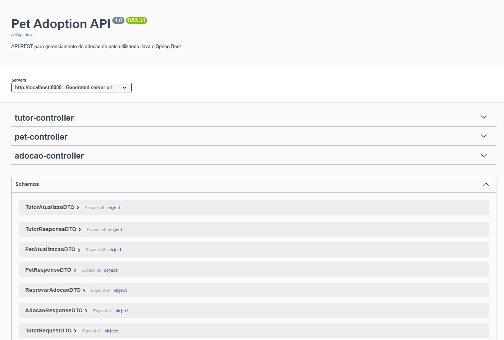
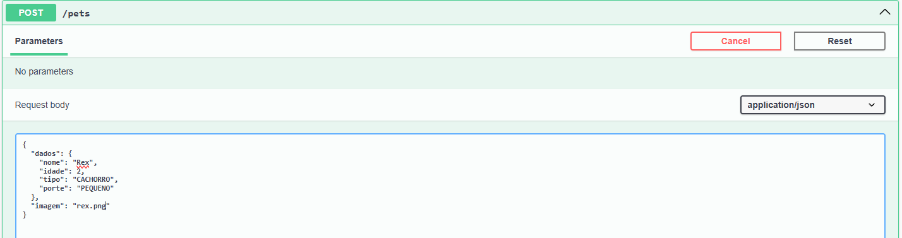

<div align="center">

# 🐾 Pet Adoption API

Sistema de gerenciamento de adoção de pets desenvolvido como uma **API REST** utilizando **Java 17**, **Spring Boot** e **MySQL**.

<p>
  
  
  
  
  
  
  
  
</p>

</div>

---

<table>
<tr>

<td width="180" align="center">


</td>

<td>

## 👨‍💻 Desenvolvedor Backend Java

**Wilson de Andrade Veloso Neto**

🎓 Bacharelando em Ciência da Computação — UESPI

📚 Aprimorando conhecimentos em Java, Spring Boot e Backend pela Alura

☕ Java | Spring Boot | APIs REST | JUnit 5 | Mockito | MySQL

<p>

<a href="https://github.com/wilsonneto-plx">

</a>

<a href="https://www.linkedin.com/in/wilson-neto-5b1207398/">

</a>

</p>

</td>

</tr>
</table>

---

# 📖 Sobre

A **Pet Adoption API** é uma API REST desenvolvida para gerenciar o processo de adoção de pets.

A aplicação oferece operações completas de **CRUD** para **Pets** e **Tutores**, além do gerenciamento de **Adoções**, permitindo cadastrá-las, listá-las, aprová-las e reprová-las.

O projeto foi desenvolvido seguindo boas práticas de desenvolvimento com o ecossistema **Spring**, utilizando **arquitetura em camadas**, **DTOs**, **Bean Validation**, **tratamento global de exceções** e **testes automatizados** para garantir a confiabilidade da aplicação.

---

# ✨ Funcionalidades

- 🐶 Cadastro, listagem, atualização e remoção de Pets
- 👤 Cadastro, listagem, atualização e remoção de Tutores
- 🏠 Cadastro e gerenciamento de Adoções
- ✅ Aprovação de adoções
- ❌ Reprovação de adoções

### Características técnicas

* ⚙️ API REST seguindo boas práticas
* 🏗️ Arquitetura em camadas
* 🗄️ Persistência de dados com Spring Data JPA
* 🐬 Banco de dados MySQL
* 📦 DTOs para comunicação entre camadas
* ✔️ Validação de dados com Bean Validation
* 🛡️ Tratamento global de exceções
* 🧪 Testes unitários com JUnit 5 e Mockito
* 🌐 Testes de Controller utilizando MockMvc

---

# 🏗️ Arquitetura do projeto

O projeto foi desenvolvido seguindo uma **arquitetura em camadas**, buscando uma melhor organização das responsabilidades, separação das regras de negócio e facilidade de manutenção.

A aplicação está estruturada nos seguintes pacotes:

```text
📦 src/main/java/adopet.api
│
├── 📂 controller
│   └── Responsável pelos endpoints REST e gerenciamento das requisições HTTP
│
├── 📂 dto
│   └── Objetos de transferência de dados entre as camadas da aplicação
│
├── 📂 exception
│   └── Gerenciamento e tratamento global das exceções da aplicação
│
├── 📂 model
│   └── Contém as entidades JPA que representam os dados persistidos
│
├── 📂 repository
│   └── Responsável pela comunicação com o banco de dados através do Spring Data JPA
│
├── 📂 service
│   └── Contém as regras de negócio e lógica da aplicação
│
├── 📂 validation
│   └── Regras de validação dos dados recebidos pela API
│
└── 📂 config
    └── Configurações da documentação Swagger/OpenAPI

```

Os testes automatizados estão organizados separadamente em:

```text

📦 src/test/java/adopet.api
│
├── 📂 controller
│   └── Testes dos endpoints REST utilizando MockMvc
│
└── 📂 service
    └── Testes das regras de negócio utilizando JUnit 5 e Mockito
```
---

# 🚀 Como Executar o Projeto

## 📋 Pré-requisitos
Antes de começar, você precisará ter instalado em sua máquina as seguintes ferramentas:
* [Java JDK 17](https://www.oracle.com/java/technologies/javase/jdk17-archive-downloads.html)
* [MySQL Server](https://www.mysql.com/)
* [Git](https://git-scm.com/)
* *(Opcional)* Uma IDE para desenvolvimento Java, como [IntelliJ IDEA](https://www.jetbrains.com/idea/) ou [Eclipse](https://www.eclipse.org/)

---

## ⚙️ Configuração e Execução

O projeto está configurado com `createDatabaseIfNotExist=true`, o que significa que **o banco de dados será criado automaticamente** pelo Spring Boot ao iniciar a aplicação — não é preciso criar nada manualmente no MySQL!

Para garantir a segurança das credenciais, o sistema utiliza **variáveis de ambiente**. Você precisa defini-las antes de rodar o projeto.

### 1. Clone o repositório e acesse a pasta
```bash
git clone https://github.com/wilsonneto-plx/pet-adoption-api.git
cd pet-adoption-api
```

### 2. Execute a aplicação
Substitua seu_usuario e sua_senha pelas credenciais do seu MySQL local:

No Linux / macOS (Terminal):
```bash
export DB_HOST=localhost:3306
export DB_NAME=adopet_db
export DB_USER=seu_usuario
export DB_PASSWORD=sua_senha

./mvnw spring-boot:run
```
No Windows (PowerShell):
```powerShell
$env:DB_HOST="localhost:3306"
$env:DB_NAME="adopet_db"
$env:DB_USER="seu_usuario"
$env:DB_PASSWORD="sua_senha"

.\mvnw.cmd spring-boot:run

```
💡 Dica para IDEs (IntelliJ / Eclipse): Se for rodar direto pela sua IDE, adicione essas mesmas chaves (DB_HOST, DB_NAME, DB_USER, DB_PASSWORD) nas configurações de Environment Variables do seu Run/Debug Configurations.

---

## 🧪 Executando os Testes

Para executar a suíte de testes automatizados (unitários e de integração), passe as variáveis de ambiente no terminal:

No Linux / macOS:
```bash
DB_HOST=localhost:3306 DB_NAME=adopet_db DB_USER=seu_usuario DB_PASSWORD=sua_senha ./mvnw test
```

No Windows (PowerShell):
```powershell
$env:DB_HOST="localhost:3306"; $env:DB_NAME="adopet_db"; $env:DB_USER="seu_usuario"; $env:DB_PASSWORD="sua_senha"; .\mvnw.cmd test
```
---

## 📷 Documentação da API

A documentação dos endpoints foi criada utilizando **Swagger/OpenAPI**.

<p align="center">
  
</p>

## 📷 Exemplo de endpoint

Exemplo da documentação de um endpoint da API utilizando Swagger/OpenAPI.

<p align="center">
  
</p>

---

<div align="center">

Desenvolvido por **Wilson de Andrade Veloso Neto**

⭐ Se este projeto foi útil para você, considere deixar uma estrela no repositório!

</div>
